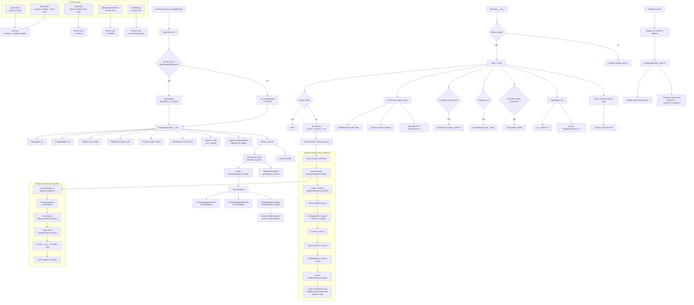
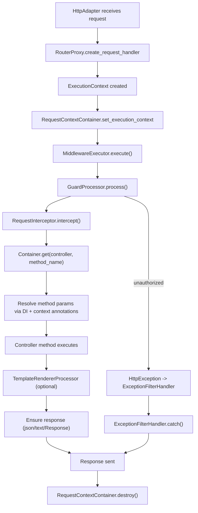

Below is a reverse-engineered view of the framework’s app lifecycle, metadata flow, DI/container mechanics, and request lifecycle based on the current codebase.

**App Lifecycle Graph (Full, Ordered Details, Vertical)**  

**App Lifecycle Order (Step-by-Step)**  
1. Import modules; decorators register providers/controllers/modules in `NestipyContainer` and write metadata to `Reflect`.
2. Call `NestipyFactory.create(AppModule)` -> setup log levels.
3. Choose adapter: if `__generic_type__ == BlackSheepApplication`, attempt BlackSheep then FastAPI; else use `config.adapter` or FastAPI.
4. `NestipyApplication.__init__` builds adapters, router proxy, middleware container, instance loader, background tasks, and config flags.
5. `NestipyApplication.init(AppModule)` adds core providers via `ModuleProviderDict` and compiles metadata with `_set_metadata`.
6. ASGI server calls app; on lifespan, `ready()` triggers `setup()` unless already ready.
7. `setup()` gathers modules via `_get_modules` (imports + dynamic modules + root).
8. `InstanceLoader.create_instances` recursively creates providers/controllers/modules via `NestipyContainer.get`.
9. Each `NestipyContainer.get` resolves singleton cache, then property injection, then constructor/method args.
10. Contextual params (Req/Res/Query/Param/etc) are resolved via `RequestContextContainer` callbacks.
11. `NestipyModule.configure` runs and can register middleware via `MiddlewareConsumer`; `OnInit` hooks run.
12. DiscoverService tracks providers/controllers/modules; GraphQL module instance is captured if present.
13. After recursion, interceptors/guards/middleware/exception filters are instantiated with `disable_scope=True`.
14. Build routes via `RouterProxy.apply_routes` -> `RouteExplorer` -> adapter route registration and OpenAPI docs.
15. Apply GraphQL resolvers and WebSocket routes if enabled.
16. Call OpenAPI registration hook if present.
17. Start HTTP adapter, mark app ready, run background tasks.
18. Always register devtools static assets and a not‑found handler route.
19. On shutdown, stop background tasks and invoke `OnDestroy` and `module.on_shutdown`.

**Entry Point**
- `NestipyFactory.create(AppModule)` constructs `NestipyApplication` and calls `init` to register root providers and build metadata.
  File: `/Users/tsiresymila/Development/Python/nestipy/src/nestipy/core/nestipy_factory.py`
- The returned `NestipyApplication` is ASGI-callable; on lifespan it calls `ready()` and `setup()`.
  File: `/Users/tsiresymila/Development/Python/nestipy/src/nestipy/core/nestipy_application.py`

**How Metadata Is Built and Read**
- Decorators write metadata using `Reflect.set_metadata`:
  - `@Module` writes `imports/providers/controllers/exports/global` and marks `_is_module_`.
    File: `/Users/tsiresymila/Development/Python/nestipy/src/nestipy/common/decorator/class_.py`
  - `@Controller` writes controller path.
    File: `/Users/tsiresymila/Development/Python/nestipy/src/nestipy/common/decorator/class_.py`
  - `@Route` / `@Get` / etc. write method path/method.
    File: `/Users/tsiresymila/Development/Python/nestipy/src/nestipy/common/decorator/method.py`
- `NestipyApplication._set_metadata()` triggers metadata creators to attach `ClassMetadata` on providers/controllers/modules for DI scoping:
  - `ProviderMetadataCreator` and `ControllerMetadataCreator` add `ClassMetadata` to each provider/controller.
  - `ModuleMetadataCreator` ensures modules get `ClassMetadata` for module-scoped lookups and merges global providers.
    Files:
    `/Users/tsiresymila/Development/Python/nestipy/src/nestipy/core/meta/metadata_creator.py`
    `/Users/tsiresymila/Development/Python/nestipy/src/nestipy/core/meta/provider_metadata_creator.py`
    `/Users/tsiresymila/Development/Python/nestipy/src/nestipy/core/meta/controller_metadata_creator.py`
    `/Users/tsiresymila/Development/Python/nestipy/src/nestipy/core/meta/module_metadata_creator.py`
- Metadata storage/retrieval lives in `Reflect` (simple dict on `__reflect__metadata__`).
  File: `/Users/tsiresymila/Development/Python/nestipy/src/nestipy/metadata/reflect.py`

**How Instances Are Created, Stored, and Resolved**
- `InstanceLoader.create_instances(modules)` iterates modules, creates providers and controllers via `NestipyContainer.get()`, and calls module hooks.
  File: `/Users/tsiresymila/Development/Python/nestipy/src/nestipy/core/instance_loader.py`
- Registration:
  - `@Injectable` registers providers into the container (singleton by default, transient for request/transient).
    File: `/Users/tsiresymila/Development/Python/nestipy/src/nestipy/common/decorator/class_.py`
  - `@Controller` registers controllers as singleton services.
    File: `/Users/tsiresymila/Development/Python/nestipy/src/nestipy/common/decorator/class_.py`
  - `ModuleProviderDict` registers custom providers and stores itself in singleton instances keyed by token.
    File: `/Users/tsiresymila/Development/Python/nestipy/src/nestipy/ioc/provider.py`
- Resolution algorithm (`NestipyContainer.get`):
  1. If singleton instance exists, return it.
  2. `_resolve_property` reads `__annotations__` on the class and resolves each annotation.
  3. `_resolve_method` resolves `__init__` args or a controller method’s args.
  File: `/Users/tsiresymila/Development/Python/nestipy/src/nestipy/ioc/container.py`
- Property injection rules:
  - Uses typing annotations. If type is `Annotated[T, Inject()]` or other `TypeAnnotated`, it can resolve context values (Request, Response, Query, etc.).
    Files:
    `/Users/tsiresymila/Development/Python/nestipy/src/nestipy/ioc/dependency.py`
    `/Users/tsiresymila/Development/Python/nestipy/src/nestipy/ioc/helper.py`
  - Contextual values are pulled from `RequestContextContainer.execution_context` (set per request).
    File: `/Users/tsiresymila/Development/Python/nestipy/src/nestipy/ioc/context_container.py`
- Scope:
  - Request scope currently maps to transient (`add_transient`) and is not a distinct cache.
    File: `/Users/tsiresymila/Development/Python/nestipy/src/nestipy/common/decorator/class_.py`
  - Updated: Request scope now uses `contextvars` with a per-request cache in `RequestContextContainer`.
    Files:
    `/Users/tsiresymila/Development/Python/nestipy/src/nestipy/ioc/context_container.py`
    `/Users/tsiresymila/Development/Python/nestipy/src/nestipy/ioc/container.py`

**Startup/Shutdown Hooks**
- `OnInit.on_startup` and `OnDestroy.on_shutdown` are called for providers/controllers as appropriate.
  Files:
  `/Users/tsiresymila/Development/Python/nestipy/src/nestipy/core/on_init.py`
  `/Users/tsiresymila/Development/Python/nestipy/src/nestipy/core/on_destroy.py`
- `NestipyModule.configure(consumer)` runs during instance creation and can register middleware via `MiddlewareConsumer`.
  Files:
  `/Users/tsiresymila/Development/Python/nestipy/src/nestipy/dynamic_module/module/interface.py`
  `/Users/tsiresymila/Development/Python/nestipy/src/nestipy/dynamic_module/module/consumer.py`

**Request Lifecycle Graph**

**Request Lifecycle Details**
- Execution context is created per request and stored in a singleton `RequestContextContainer`, allowing `@Req`, `@Res`, `@Query`, etc. to resolve.
  Files:
  `/Users/tsiresymila/Development/Python/nestipy/src/nestipy/core/router/router_proxy.py`
  `/Users/tsiresymila/Development/Python/nestipy/src/nestipy/core/context/execution_context.py`
  `/Users/tsiresymila/Development/Python/nestipy/src/nestipy/ioc/context_container.py`
- Order of processing: middleware -> guards -> pipes -> interceptors -> handler -> template rendering -> response -> exception filters.
  Files:
  `/Users/tsiresymila/Development/Python/nestipy/src/nestipy/core/middleware/executor.py`
  `/Users/tsiresymila/Development/Python/nestipy/src/nestipy/core/guards/processor.py`
  `/Users/tsiresymila/Development/Python/nestipy/src/nestipy/core/pipes/processor.py`
  `/Users/tsiresymila/Development/Python/nestipy/src/nestipy/core/interceptor/processor.py`
  `/Users/tsiresymila/Development/Python/nestipy/src/nestipy/core/exception/processor.py`

**“When stop”**
- App shutdown calls `NestipyApplication._destroy()` via the adapter shutdown hook; it stops background tasks and calls `InstanceLoader.destroy()` to invoke `OnDestroy` on providers/controllers and `on_shutdown` on modules.
  File: `/Users/tsiresymila/Development/Python/nestipy/src/nestipy/core/nestipy_application.py`
