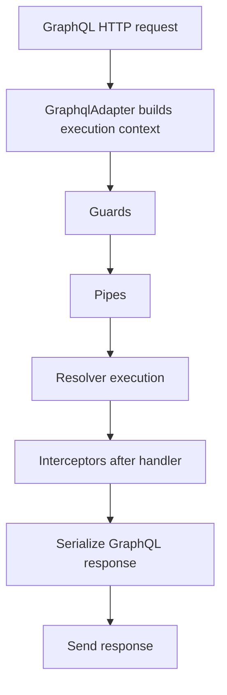

Nestipy uses Strawberry as its GraphQL engine and exposes a NestJS-like API for resolvers, guards, interceptors, and filters. The GraphQL module integrates with the same DI container you use for HTTP.

## Install

```bash
pip install strawberry-graphql
```

## Configuration

Add `GraphqlModule` to your root module:

```python
from nestipy.common import Module
from nestipy.graphql import GraphqlModule, GraphqlOption


@Module(
    imports=[
        GraphqlModule.for_root(
            options=GraphqlOption(
                url="/graphql",
                ide="graphiql",
                auto_schema_file=None,
            )
        )
    ],
    providers=[CatsResolver],
)
class AppModule:
    pass
```

`GraphqlOption` supports:

- `url` for the GraphQL endpoint.
- `ide` for the built-in playground.
- `auto_schema_file` to write schema output to disk.
- `context_callback` for custom request context.
- `schema_option` for Strawberry `Schema` kwargs (or `SchemaOption` dataclass).
- `asgi_option` for Strawberry ASGI `GraphQL` kwargs (or `ASGIOption` dataclass).
- `schema` or `schema_factory` for pre-built schemas (schema-first or custom build).

## Basic Resolver

```python
import asyncio
from typing import AsyncIterator, Annotated, Any

from nestipy.common import UseGuards, Request
from nestipy.graphql import Query, Resolver, Mutation, ResolveField, Args, Context, Parent, Info
from nestipy.graphql.decorator import Subscription
from nestipy.graphql.strawberry import ObjectType
from nestipy.ioc import Req


@ObjectType()
class Test:
    test1: str
    test2: str


@Resolver(of=Test)
class UserResolver:
    @Query()
    def test_query(
        self,
        test: Annotated[str, Args("test")],
        info: Annotated[Any, Info()],
        ctx: Annotated[dict, Context()],
        req: Annotated[Request, Req()],
    ) -> Test:
        return Test(test1="test1", test2="hello")

    @Mutation()
    def test_mutation(self) -> str:
        return "Mutation"

    @Subscription()
    async def test_subscription(self, count: Annotated[int, Args("count")] = 5) -> AsyncIterator[int]:
        for i in range(count):
            yield i
            await asyncio.sleep(0.5)

    @ResolveField()
    async def test2(self, root: Annotated[Test, Parent()]) -> str:
        return "resolved " + root.test1
```

Notes:

- `Args()` returns the full arguments dict.
- `Args("id")` returns a single argument by name.

## Advanced Options

You can pass any Strawberry options directly:

```python
from datetime import timedelta

from nestipy.graphql import GraphqlOption

GraphqlOption(
    schema_option={
        "extensions": [],
        "directives": [],
        "types": [],
        "schema_directives": [],
    },
    asgi_option={
        "allow_queries_via_get": True,
        "graphql_ide": None,
        "multipart_uploads_enabled": False,
        "connection_init_wait_timeout": timedelta(minutes=1),
    },
)
```

Or use typed options:

```python
from nestipy.graphql import GraphqlOption, SchemaOption, ASGIOption

GraphqlOption(
    schema_option=SchemaOption(types=[], directives=[]),
    asgi_option=ASGIOption(allow_queries_via_get=True),
)
```

## Lifecycle Overview



## Guards and Filters

Guards and filters work the same way as HTTP. Use `ExecutionContext.switch_to_graphql()` to access GraphQL-specific data.

## Next Steps

See the resolver, mutation, and subscription pages for deeper examples and patterns.
