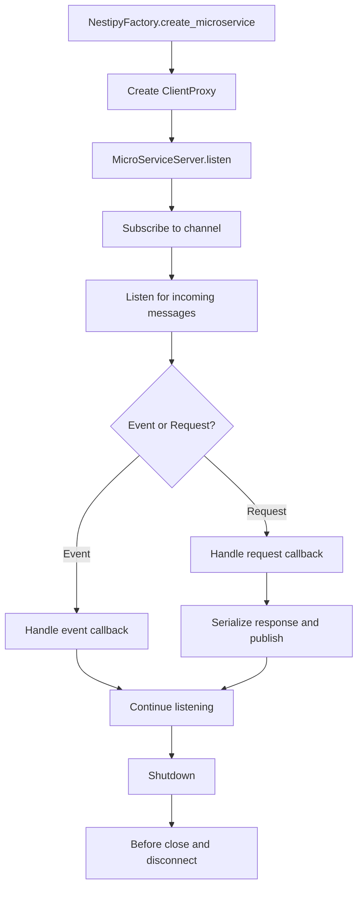

Nestipy supports both monolithic and microservice architectures. The microservice layer mirrors NestJS patterns while keeping the same DI, guards, interceptors, and filters you already use for HTTP.

## Getting Started

Create a microservice using `NestipyFactory.create_microservice()`:

```python
import random
from granian.constants import Interfaces

from app_module import AppModule
from nestipy.core import NestipyFactory
from nestipy.microservice import MicroserviceOption, Transport

app = NestipyFactory.create_microservice(
    AppModule,
    [MicroserviceOption(transport=Transport.TCP)],
)

if __name__ == "__main__":
    app.listen(
        "main:app",
        address="0.0.0.0",
        port=random.randint(5000, 7000),
        interface=Interfaces.ASGI,
        reload=True,
    )
```

## Lifecycle Overview

This diagram shows how a microservice instance starts, listens, and shuts down.



## Message and Event Patterns

Nestipy supports two patterns:

- Request-response with `@MessagePattern`
- Fire-and-forget with `@EventPattern`

Request-response:

```python
from typing import Annotated
from nestipy.common import Controller
from nestipy.ioc import Inject
from nestipy.microservice import MessagePattern, Payload


@Controller()
class AppController:
    service: Annotated[AppService, Inject()]

    @MessagePattern("test")
    async def get(self, data: Annotated[str, Payload()]) -> str:
        return await self.service.get()
```

Event pattern:

```python
from typing import Annotated
from nestipy.common import Controller
from nestipy.ioc import Inject
from nestipy.microservice import EventPattern, Payload


@Controller()
class AppController:
    service: Annotated[AppService, Inject()]

    @EventPattern("test")
    async def get(self, data: Annotated[str, Payload()]) -> None:
        await self.service.get()
```

## Client Registration

Register clients with `ClientsModule`:

```python
from nestipy.common import Module
from nestipy.microservice import ClientsModule, ClientsConfig
from nestipy.microservice import MicroserviceOption, Transport


@Module(
    imports=[
        ClientsModule.register(
            [
                ClientsConfig(
                    name="MATH_SERVICE",
                    option=MicroserviceOption(transport=Transport.TCP),
                )
            ]
        )
    ],
)
class AppModule:
    pass
```

Or register a provider manually:

```python
from typing import Annotated

from nestipy.common import Module, ModuleProviderDict, ConfigModule, ConfigService
from nestipy.ioc import Inject
from nestipy.microservice import ClientProxy, ClientModuleFactory
from nestipy.microservice import MicroserviceOption, Transport, TCPClientOption


async def factory(config: Annotated[ConfigService, Inject()]) -> ClientProxy:
    return ClientModuleFactory.create(
        MicroserviceOption(
            transport=Transport.TCP,
            option=TCPClientOption(
                host=config.token.get("HOST"),
                port=config.get("PORT"),
            ),
        )
    )


@Module(
    providers=[
        ModuleProviderDict(
            token="MATH_SERVICE",
            factory=factory,
            inject=[ConfigModule.for_root()],
        )
    ]
)
class AppModule:
    pass
```

Inject the client:

```python
from typing import Annotated
from nestipy.common import Controller
from nestipy.microservice import Client, ClientProxy


@Controller()
class AppController:
    client: Annotated[ClientProxy, Client("MATH_SERVICE")]
```

## Sending and Emitting

Use `send` for request-response and `emit` for events:

```python
response = await client.send("sum", {"a": 1, "b": 2})
await client.emit("audit", {"action": "sum"})
```

## Context and Payload

- `Payload()` injects the message payload.
- `Ctx()` or `Context` injects the RPC context.

```python
from typing import Annotated
from nestipy.microservice import Payload, Ctx, Context


@MessagePattern("ping")
async def handle(
    data: Annotated[dict, Payload()],
    ctx: Annotated[Context, Ctx()],
):
    return {"ok": True}
```

## Custom Response (Headers/Status)

If you need to set response headers or return a pre-built response, return `RpcResponse` directly.

```python
from nestipy.microservice import RpcResponse


@MessagePattern("sum-headers")
async def sum_headers(self, payload: Annotated[dict, Payload()]):
    return RpcResponse(
        pattern="ignored",
        data={"sum": payload["a"] + payload["b"]},
        status="success",
        headers={"x-result": "ok"},
    )
```

## Options and Defaults

`MicroserviceOption` supports these key fields:

- `transport` selects the transport.
- `option` is the transport-specific configuration object.
- `serializer` controls request serialization. Default is JSON.
- `channel_key` is the message channel prefix. Default is `nestipy`.
- `timeout` is the client request timeout in seconds. Default is `30`.

## Guards, Interceptors, Filters

Guards, interceptors, and filters work the same way as HTTP. The main difference is the RPC context and `RpcExceptionFilter`.

```python
from nestipy.common import Catch
from nestipy.microservice import RpcException, RpcExceptionFilter


@Catch(RpcException)
class MyRpcExceptionFilter(RpcExceptionFilter):
    async def catch(self, exception: "RpcException", host: "ArgumentHost"):
        return exception.message
```

## Testing Microservices

You can test microservice handlers without a real broker by using an in-memory client proxy. This gives you fast, deterministic integration tests.

```python
from dataclasses import asdict

from nestipy.microservice import RpcRequest, RpcResponse, MICROSERVICE_CHANNEL
from nestipy.microservice import Transport
from nestipy.microservice.client.base import ClientProxy, MicroserviceOption


class InMemoryClientProxy(ClientProxy):
    def __init__(self, option: MicroserviceOption):
        super().__init__(option)
        self.published = []
        self.listen_payloads = []

    async def slave(self):
        return self

    async def _connect(self):
        self._mark_connected()

    async def _publish(self, topic, data):
        self.published.append((topic, data))

    async def subscribe(self, *_args, **_kwargs):
        pass

    async def unsubscribe(self, *_args):
        pass

    async def send_response(self, topic, data):
        self.published.append((topic, data))

    async def listen(self):
        for payload in list(self.listen_payloads):
            yield payload

    async def listen_response(self, from_topic: str, timeout: int = 30) -> str:
        response = RpcResponse(pattern=from_topic, data={"ok": True}, status="success")
        return await self.option.serializer.serialize(asdict(response))

    async def _close(self):
        self._mark_disconnected()


# Example usage in a test:
option = MicroserviceOption(transport=Transport.CUSTOM)
client = InMemoryClientProxy(option)
option.proxy = client
await microservice.ms_setup()
server = microservice.servers[0]

request = RpcRequest(data={"a": 1, "b": 2}, pattern="sum", response_topic="resp-1")
await server.handle_request(request)

topic, payload = client.published[0]
assert topic == f"{MICROSERVICE_CHANNEL}:response:{request.response_topic}"
```

## Hybrid Application

To run HTTP and microservices together, connect microservices to an HTTP app:

```python
from granian.constants import Interfaces

from app_module import AppModule
from nestipy.core import NestipyFactory
from nestipy.microservice import MicroserviceOption, Transport

app = NestipyFactory.connect_microservice(
    AppModule,
    [MicroserviceOption(transport=Transport.TCP)],
)

app.start_all_microservices()

if __name__ == "__main__":
    app.listen(
        "main:app",
        address="0.0.0.0",
        port=8000,
        interface=Interfaces.ASGI,
        reload=True,
    )
```

Call `app.start_all_microservices()` to start microservice servers after HTTP boot.
