# Internal Architecture

This page describes the internal structure of `NestipyApplication` after the refactor into helper modules and registrars. The goal is to keep the main class focused on orchestration while delegating implementation details to well-scoped helpers.

## High-Level Flow

```mermaid
flowchart TD
    A["NestipyApplication"] --> B["_NestipyHelpers"]
    A --> C["_NestipyRegistrars"]

    B --> B1["WebStaticHandler\nweb/web_static.py"]
    B --> B2["DevtoolsRegistrar\nweb/devtools_routes.py"]
    B --> B3["GranianServerRunner\nserver/granian_server.py"]
    B --> B4["LifecycleRunner\nlifecycle/lifecycle_runner.py"]
    B --> B5["GlobalEnhancerManager\nenhancers/global_enhancer_manager.py"]
    B --> B6["ConfigManager\nconfig/config_manager.py"]
    B --> B7["ViewManager\nviews/view_manager.py"]

    C --> C1["RouteRegistrar\nregistrars/routes.py"]
    C --> C2["GraphqlRegistrar\nregistrars/graphql.py"]
    C --> C3["WebsocketRegistrar\nregistrars/websockets.py"]
    C --> C4["OpenApiRegistrar\nregistrars/openapi.py"]

    A --> D["setup()"]
    D --> D1["_init_di()"]
    D1 --> D2["InstanceLoader.create_instances()"]
    D1 --> D3["NestipyContainer.precompute_dependency_graph()"]
    D1 --> D4["RouteRegistrar.apply()"]

    D --> D5["GraphqlRegistrar.apply()"]
    D --> D6["WebsocketRegistrar.apply()"]
    D --> D7["OpenApiRegistrar.register()"]
    D --> D8["WebStaticHandler.register()"]
    D --> D9["DevtoolsRegistrar.register_*()"]
    D --> D10["register_not_found()"]

    A --> E["__call__ (ASGI)"]
    E --> EH["AsgiHandler\nhttp/asgi_handler.py"]
    EH --> E1["WebStaticHandler.maybe_handle()"]
    EH --> E2["HttpAdapter.__call__"]
```

## Responsibilities

- `NestipyApplication`
  - Orchestrates setup order, lifecycle hooks, and the ASGI entrypoint.
  - Keeps configuration and metadata boundaries in one place.
  - Delegates concrete logic to helpers/registrars.

- Helpers
  - `WebStaticHandler`: static assets, devtools, SSR detection, not-found fallback.
  - `DevtoolsRegistrar`: graph + router spec + static devtools assets.
  - `GranianServerRunner`: `listen()` / Granian options plumbing.
  - `LifecycleRunner`: application bootstrap and shutdown hooks.

- Registrars
  - `RouteRegistrar`: route discovery and conflict checking.
  - `GraphqlRegistrar`: GraphQL module discovery + resolver registration.
  - `WebsocketRegistrar`: websocket gateways / socket routes.
  - `OpenApiRegistrar`: lazy OpenAPI endpoint registration.

## Why This Split

- Smaller, testable modules with single responsibilities.
- Easier to reason about setup order and side-effects.
- Lower risk of circular dependencies when extending the core.

## Extending

To add a new concern (e.g., new transport, metrics, tracing), create a helper or registrar and wire it once in `NestipyApplication.__init__`.
