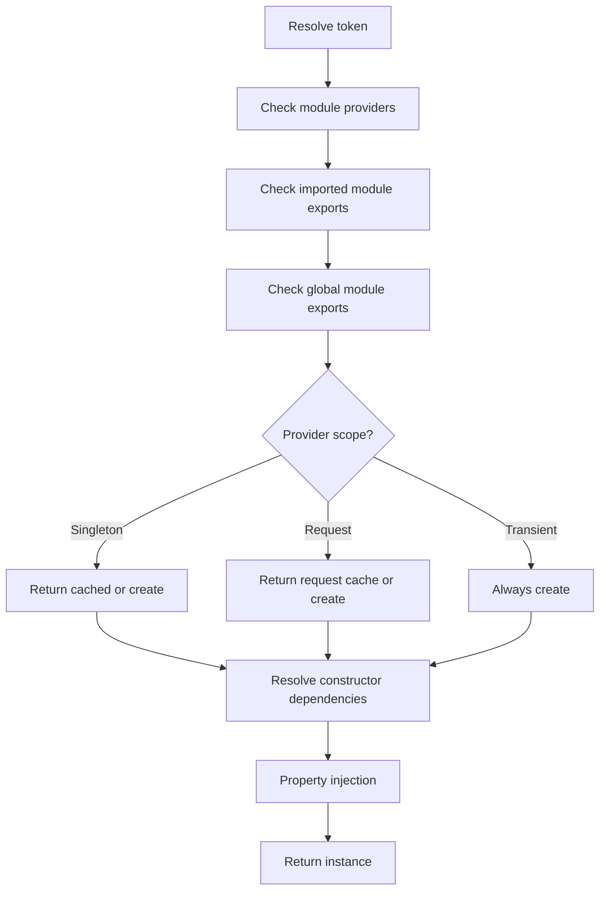

# Providers

Providers are a fundamental concept in Nestipy. Many of the basic Nestipy classes may be treated as providers – services, repositories, factories, helpers, and so on. The main idea of a provider is that it can be **injected** as a dependency; this means objects can create various relationships with each other, and the function of "wiring up" instances of objects can largely be delegated to the Nestipy runtime system.

A provider is simply a class annotated with the `@Injectable()` decorator and registered within a **Module**.

## Services

Services are the most common type of provider. They are typically used to encapsulate business logic, data access, or integration with external APIs. By separating logic into services, you keep your controllers lean and focused on routing.

```python
from typing import Any
from nestipy.common import Injectable

@Injectable()
class CatsService:
    def __init__(self):
        self._cats: list[dict] = []

    def create(self, cat: dict):
        self._cats.append(cat)

    def find_all(self) -> list[dict]:
        return self._cats
```

To make `CatsService` available for injection, it must be registered in the `providers` array of a module:

```python
from nestipy.common import Module
from .cats_service import CatsService

@Module(
    providers=[CatsService],
)
class CatsModule:
    pass
```

## Dependency Injection (DI)

Nestipy is built around the strong architectural pattern commonly known as **Dependency Injection**. It's an Inversion of Control (IoC) technique where you delegate the responsibility of instantiating dependencies to the container.

### Constructor Injection
The most common and recommended way to inject dependencies is through the constructor. Nestipy automatically resolves the types and provides the instances.

```python
@Controller("cats")
class CatsController:
    def __init__(self, service: CatsService):
        # Nestipy sees 'service' needs a 'CatsService' and provides it
        self.service = service

    @Get()
    async def find_all(self):
        return self.service.find_all()
```

### Property Injection
In some cases, such as when you have a large inheritance chain or need to access request-scoped providers from a singleton, property injection is useful.

```python
from typing import Annotated
from nestipy.ioc import Inject

@Controller("cats")
class CatsController:
    # Lazily injected property
    service: Annotated[CatsService, Inject()]
```

## Provider Scopes

In Nestipy, providers have a **scope** that determines their lifetime and how they are shared across the application. Understanding scopes is vital for managing state and performance.

| Scope | Description |
| :--- | :--- |
| `Singleton` | **(Default)** A single instance of the provider is shared across the entire application. The instance is created during the bootstrapping process. |
| `Transient` | A new instance of the provider is created every time it is injected into another class. |
| `Request` | A new instance is created for each incoming request. The instance is cached within the request context and destroyed once the request is complete. |

```python
from nestipy.common import Injectable, Scope

@Injectable(scope=Scope.Request)
class RequestScopedService:
    pass
```

### Request-scoped Providers in Singletons
Since singletons are created at startup and request-scoped providers are created per request, you cannot inject a request-scoped provider into a singleton's constructor. Instead, use **Property Injection** with `Annotated[..., Inject()]`. Nestipy will resolve the property at runtime within the active request context.

## DI Resolution Flow

The Nestipy DI container follows a specific logic to resolve dependencies:



## Custom Providers

While class-based providers are the norm, Nestipy supports advanced DI patterns:
- **Value providers**: Inject a constant value.
- **Factory providers**: Dynamically create a provider using a function and other dependencies.
- **Alias providers**: Mapping one token to another existing provider.

---

**Next Up:** Learn how to organize your application into logical units in the [Modules](/overview/module) section.
