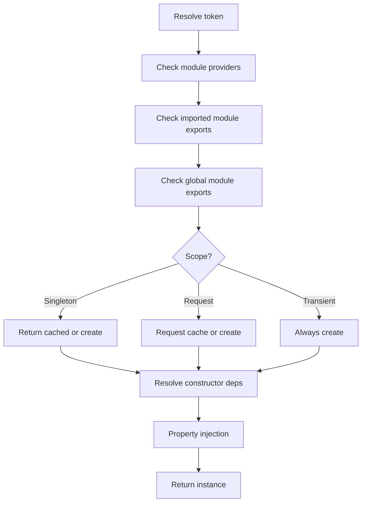

This page explains how Nestipy resolves dependencies, how request scope works, and how to safely use request-scoped providers inside singleton services.

## Mental Model

Nestipy resolves dependencies in layers:

- Module providers
- Imported module exports
- Global module exports

After the provider is found, its scope determines how it is cached and reused.

## Request Scope in Nestipy

Request-scoped providers are cached per request using Python `contextvars`. A fresh cache is created at the start of each request and is cleared at the end of the request pipeline.

This makes request-scoped dependencies safe even with concurrent requests.

## Resolution Flow



## Request-Scoped in Singletons

A singleton cannot safely hold a request-scoped instance as a constructor dependency. That would freeze a single request instance forever. Nestipy avoids that by using lazy property injection for request-scoped dependencies.

```python
from typing import Annotated
from nestipy.common import Injectable, Scope
from nestipy.ioc import Inject


@Injectable(scope=Scope.Request)
class RequestId:
    def __init__(self):
        self.value = id(self)


@Injectable()
class CatsService:
    request_id: Annotated[RequestId, Inject()]
```

When `request_id` is accessed, Nestipy resolves the request-scoped instance using the current request context. That means each request sees a different `RequestId`.

## Request Cache Boundaries

The request cache is reset at the start of the request pipeline and destroyed at the end. This ensures:

- Request-scoped providers are isolated per request.
- Cached request instances are not reused across concurrent requests.

## When to Use Each Scope

- Singleton: default for stateless services and shared clients.
- Request: per-request state like user context or tracing IDs.
- Transient: disposable helpers that should never be cached.

## Common Pitfalls

- Do not constructor-inject request-scoped providers into singletons.
- Avoid large request-scoped object graphs if you can keep state in the request object.
- Prefer transient scope only for cheap objects.
