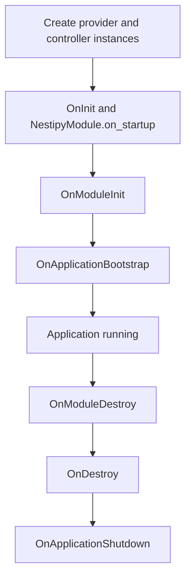

Nestipy provides lifecycle hooks similar to NestJS. These hooks let you run logic during startup, after bootstrap, and during shutdown. Hooks can be implemented by providers, controllers, or modules.

## Available Hooks

- `OnInit` with `on_startup()` runs when an instance is created.
- `OnModuleInit` with `on_module_init()` runs after all providers and controllers in a module are created.
- `OnApplicationBootstrap` with `on_application_bootstrap()` runs once after the entire app is bootstrapped.
- `OnModuleDestroy` with `on_module_destroy()` runs during shutdown before `OnDestroy`.
- `OnDestroy` with `on_shutdown()` runs during shutdown for cleanup.
- `OnApplicationShutdown` with `on_application_shutdown()` runs at the end of the shutdown process.

## Order of Execution

The high-level order is:



Notes:

- `OnInit` runs per instance, immediately after it is created.
- `OnModuleInit` runs after a module and its imports are resolved and instances are created.
- `OnApplicationBootstrap` runs once for all providers, controllers, and modules.
- Shutdown hooks run in the order shown above.

## Example

```python
from nestipy.common import Injectable
from nestipy.core import OnInit, OnModuleInit, OnApplicationBootstrap
from nestipy.core import OnModuleDestroy, OnDestroy, OnApplicationShutdown


@Injectable()
class ExampleService(
    OnInit,
    OnModuleInit,
    OnApplicationBootstrap,
    OnModuleDestroy,
    OnDestroy,
    OnApplicationShutdown,
):
    async def on_startup(self):
        print("OnInit")

    async def on_module_init(self):
        print("OnModuleInit")

    async def on_application_bootstrap(self):
        print("OnApplicationBootstrap")

    async def on_module_destroy(self):
        print("OnModuleDestroy")

    async def on_shutdown(self):
        print("OnDestroy")

    async def on_application_shutdown(self):
        print("OnApplicationShutdown")
```

## Module Hooks

If your module extends `NestipyModule`, you can override `configure()`, `on_startup()`, and `on_shutdown()` in addition to the standard hooks above.
